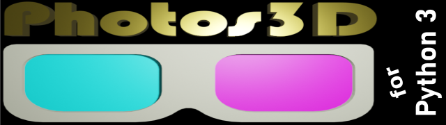

# Python3 3D photos utilities and library

This repository contains a simple library, with examples, for loading and manipulating 3D photos and images in Python 3. The main code modules for the library can be found in the 'photos3d' folder.

For information on the latest updates please refer to [the changelog](./CHANGELOG.md).

## Screenshots

Below are some screenshots to illustrate use of Photos3D in Python 3. They show loading and viewing side-by-side images, rotating stereo image pairs, creating an anaglyph from stereo image pairs and splitting a monochrome anaglyph into two stereo views. However, Photos3D is capable of much more, as the list of examples below shows.

## Example Python 3 code

Example Python 3 code files are:

* batchprocess.py - Shows how to do batch processing of all images in the imagestoprocess folder in on operation (e.g. changing aspect ratios and swapping left/right views).
* cardsplit.py - Illustrates extraction of second panorama image from a Google Cardboard Camera photo, for use in making stereo pairs.
* glyph2sbs.py - Example of how to split left and right views from a monochrome anaglyph.
* jpegdump.py - A utility to print out structure details (e.g. marker types and exif, xmp, exmp locations) for analysing JPEG-based files (e.g. JPG, JPS, MPO) before coding.
* jpegsplit.py - Example of extracting all images from a JPEG container file, such as an MPO file.
* makeglyph.py - Example of making an anaglyph image from left and right image files.
* makesbs.py - Example of making a side-by-side image from left and right image files.
* loadsbs.py - Example of loading MPO and side-by-side JPG files.
* rotatewithcrop.py - Example of loading and rotating side-by-side images with automatic cropping.
* sbs2glyph.py - Example of loading a side-by-side image and converting it to an anaglyph.

## Credits

The following sources of information and code are gratefully acknowledged:

* The code in image.py for automagically cropping rotated images is [based on examples on Stack Overflow](https://stackoverflow.com/questions/16702966/rotate-image-and-crop-out-black-borders).
* The formula in image.py to convert colours to luminance-based monochrome [is taken from Wikipedia](https://en.wikipedia.org/wiki/Grayscale).
* The open source [jpegdump.c](https://svn.xiph.org/experimental/giles/jpegdump.c) program was invaluable in providing a wide range of JPEG markers to add to the standard ones in the jpegtool library.

This repository is copyright 2022-2023 Andrew Thomas who also runs [parth3d.co.uk](https://parth3d.co.uk). Please enjoy them both :-)
