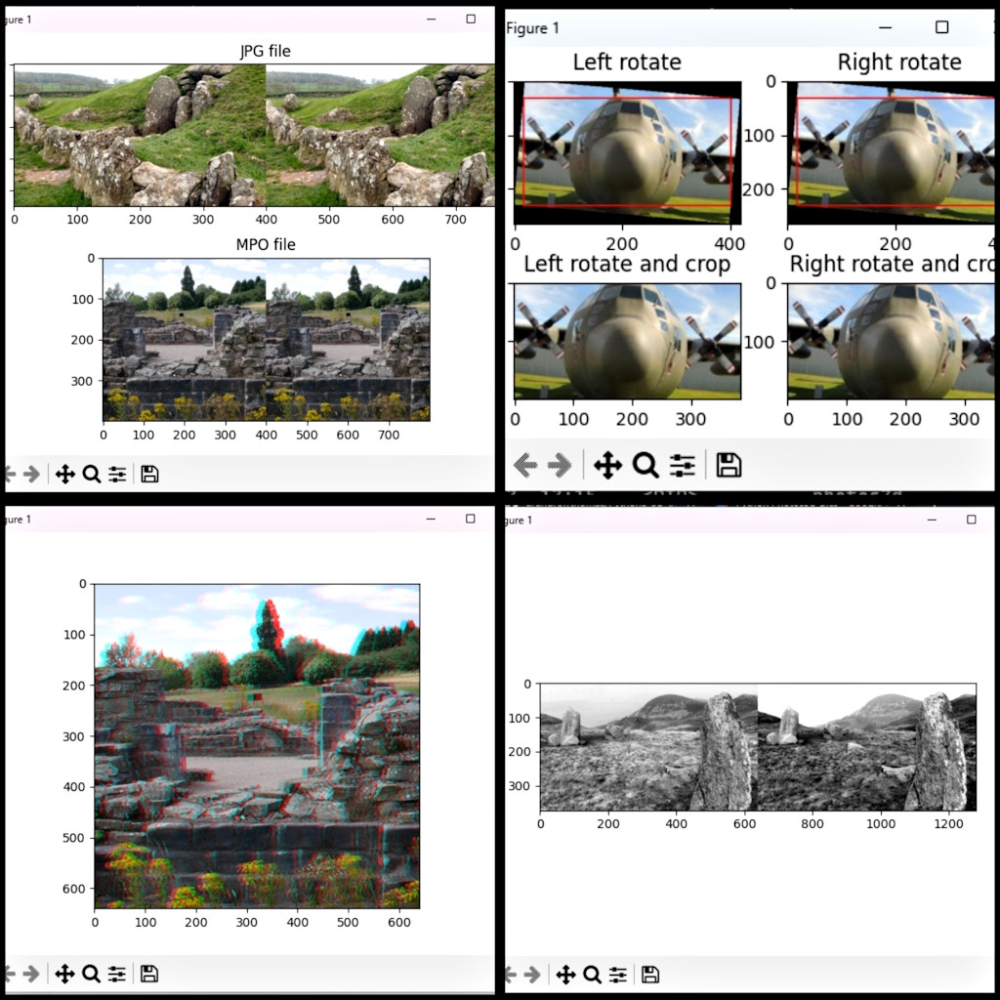

# Python3 3D photos utilities and library

This repository contains a simple library, with examples, for loading and manipulating 3D photos and images in Python 3. The main code modules for the library can be found in the 'photos3d' folder.

## Example code

Example Python 3 code files are:

* anabatch.py - Converts all side-by-side images in the 'convertglyph' folder to anaglyphs.
* mpobatch.py - Converts all MPO files in the 'convertmpo' folder to side-by-side JPG files.
* glyph2sbs.py - Example of how to split left and right views from a monochrome anaglyph.
* loadsbs.py - Example of loading MPO and side-by-side JPG files.
* rotatewithcrop.py - Example of loading and rotating side-by-side images with automatic cropping.
* sbs2glyph.py - Example of loading a side-by-side image and converting it to an anaglyph.

## Credits

This repository is copyright 2023 Andrew Thomas who also runs [parth3d.co.uk](https://parth3d.co.uk). Please enjoy them both :-)
